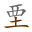
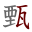

<ruby>えん </ruby> <ins>[**けむ**り](https://jisho.org/search/けむ)</ins>る・い　<ins>[<ruby>禁煙<rt>きん　　</rt></ruby>](https://jisho.org/search/禁煙)</ins>　[<ruby>喫煙<rt>きつ　　</rt></ruby>](https://jisho.org/search/喫煙)　
<ruby>えん </ruby> [**かく**す](https://jisho.org/search/隠す)　
<ruby>けん </ruby> [**みわ**ける](https://jisho.org/search/見分ける)　[<ruby>甄別<rt>　　べつ</rt></ruby>](https://cantonese.org/search.php?q=甄別)　[<ruby>甄選<rt>　　せん</rt></ruby>](https://cantonese.org/search.php?q=甄選)　
